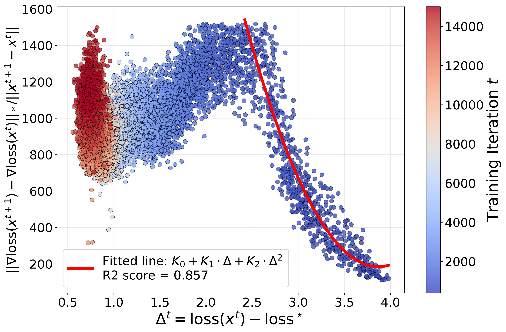
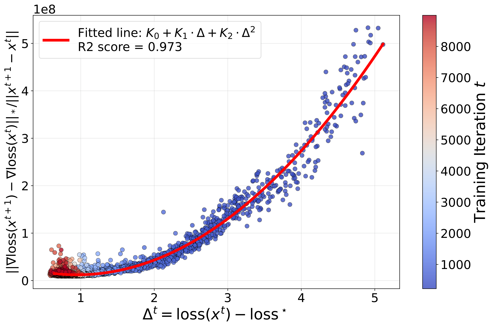
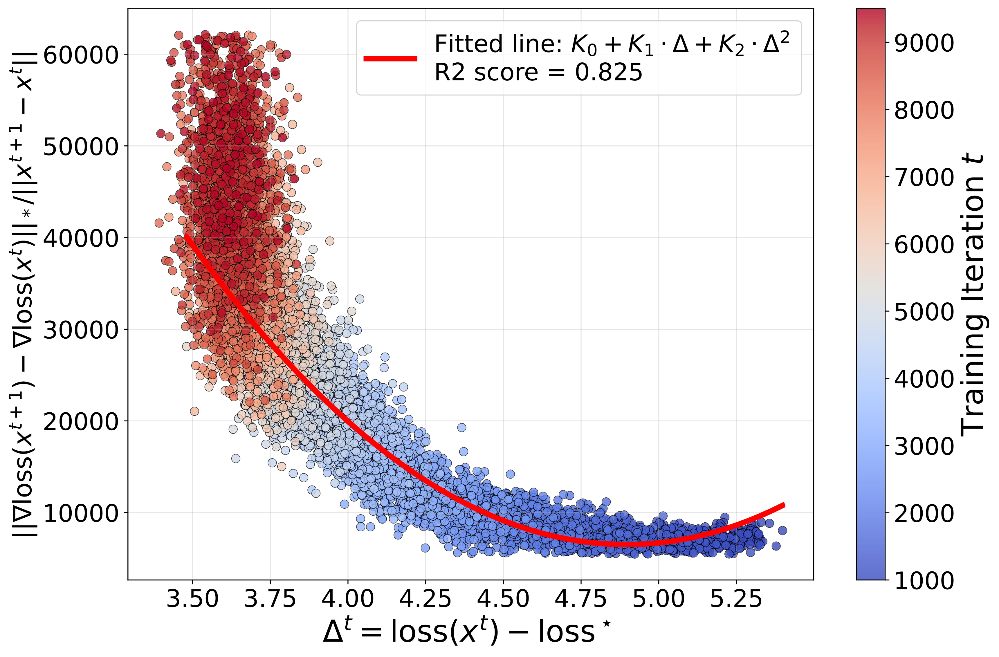
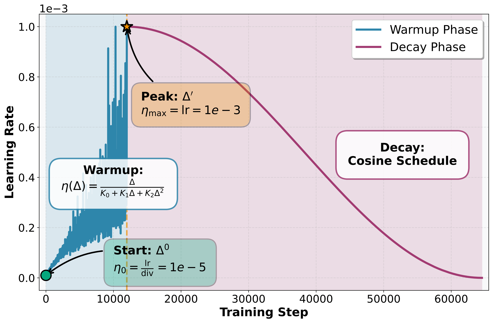

# Where Does Warm-Up Come From? Adaptive Scheduling for Norm-Constrained Optimizers 

This repository contains the official code for the paper Where Does Warm-Up Come From? Adaptive Scheduling for Norm-Constrained Optimizers.

## Overview

This codebase is adapted from the excellent [llm-baselines](https://github.com/epfml/llm-baselines) repository and extends it with our novel adaptive learning rate scheduler based on a new smoothness assumption for linear minimization oracle (LMO) optimizers.

Our key contributions include:
- A new smoothness assumption that better captures the geometry of LMO-based optimization
- Empirical analysis validating our theoretical assumptions across multiple optimizers
- An adaptive learning rate scheduler with automatic warmup selection (Algorithm 1 from the paper)

## Key Components

### 1. Smoothness Analysis (`lipschitz_analyzer.py`)

This module implements the analysis of our new smoothness assumption from the paper. It computes the ratio:

$$\mathcal{K}^t = \frac{\|\nabla f(x^{t+1}) - \nabla f(x^{t})\|_\star}{\|x^{t+1}-x^t\|}$$

along optimization trajectories for various optimizers. This empirical analysis validates our theoretical framework.

**Results:**

<p align="center">
  
  
  
</p>

*Figure: Smoothness constant evolution for D-Muon, Lion, and Normalized SGD optimizers.*

### 2. Adaptive Learning Rate Scheduler (`lipschitz_scheduler.py`)

Our main contribution: an adaptive learning rate scheduler that implements Algorithm 1 from the paper. The scheduler computes learning rates as:

$$\eta_t = \frac{\Delta_t}{K_0 + K_1 \Delta_t + K_2 \Delta_t^2}$$

where $\Delta_t = f(x^t) - f^\star$ is the optimality gap, and $K_0, K_1, K_2$ are Lipschitz-related constants.

**Key features:**
- Automatic warmup selection based on optimizer characteristics
- Easy integration as a standard PyTorch scheduler
- Compatible with multiple LMO-based optimizers (Muon, Lion, SignSGD, etc.)

**Usage example:**
```python
from src.optim.lipschitz_scheduler import LipschitzScheduler

scheduler = LipschitzScheduler(
    optimizer,
    K_0=K_0,
    K_1=K_1,
    K_rho=K_2,
    loss_star=3.2,
    rho=2.0,
)

# During training (see /src/optim/base.py):
train_loss = loss.detach().cpu().item() * cfg.acc_steps
scheduler.step(loss=train_loss)
```

The learning rate schedule follows a carefully designed warmup-then-decay pattern:

<p align="center">
  
</p>

*Figure: Illustration of our adaptive learning rate schedule.*

### 3. Parameter Initialization (`lipschitz_computeK.py`)

This module computes the optimal initialization parameters $K_0, K_1, K_2, \Delta^\star$ based on:

1. **Optimizer-specific norms**: The choice of dual norm $\|\cdot\|_\star$ depends on the optimizer:
   - **Muon**: Uses spectral norm / nuclear norm (dual norms)
   - **Lion/SignSGD**: Uses $\ell_\infty$ / $\ell_1$ norm (dual norms)
   - **Normalized SGD**: Uses Frobenius norm (self-dual)

2. **Smoothness weight function**: Gaussian weighting $w(\Delta; \Delta^\star) = \exp(-((\Delta - \Delta^\star)^2) / (2\sigma_{\text{norm}}^2))$ where:
   $$\sigma_{\text{norm}} = \sigma_F / \kappa, \quad \kappa = \sup_v \frac{\|v\|_\star}{\|v\|}$$

3. **Optimization constraints**:
   - $\eta(\Delta^\star) = \eta_{\max}$ (peak learning rate at optimal gap)
   - $\eta(\Delta_0) = \eta_{\max}/\text{div}$ (initial learning rate)
   - $\eta'(\Delta^\star) = 0$ (critical point at optimal gap)
   - Smooth transition combining cosine warmup (0 to $\Delta^\star$) and linear decay ($\Delta^\star$ to $\Delta_0$)

The parameters are found by minimizing the weighted squared error between the scheduler curve and the target schedule over the optimality gap range.

## Main Results

Our adaptive scheduler achieves superior or competitive performance compared to hand-tuned baselines across different model sizes and batch sizes.

### Llama 124M Model

<p align="center">
  
  
</p>

<p align="center">
  
  
</p>

<p align="center">
  
  
</p>

### Llama 210M Model

<p align="center">
  
  
</p>

<p align="center">
  
  
</p>

<p align="center">
  
  
</p>

*Figure: Training curves comparing our adaptive scheduler against baseline configurations. Our method (orange) matches or exceeds the performance of carefully tuned learning rates across different optimizers, model sizes, and batch sizes.*

## Installation

```bash
python3.11 -m venv optim_venv
source optim_venv/bin/activate
pip install -r requirements.txt
```

## Acknowledgments

This codebase builds upon the excellent [llm-baselines](https://github.com/epfml/llm-baselines) repository by EPFL ML. We thank the authors for making their code publicly available, which significantly accelerated our research.

## License

This project inherits the license from the original [llm-baselines](https://github.com/epfml/llm-baselines) repository.
